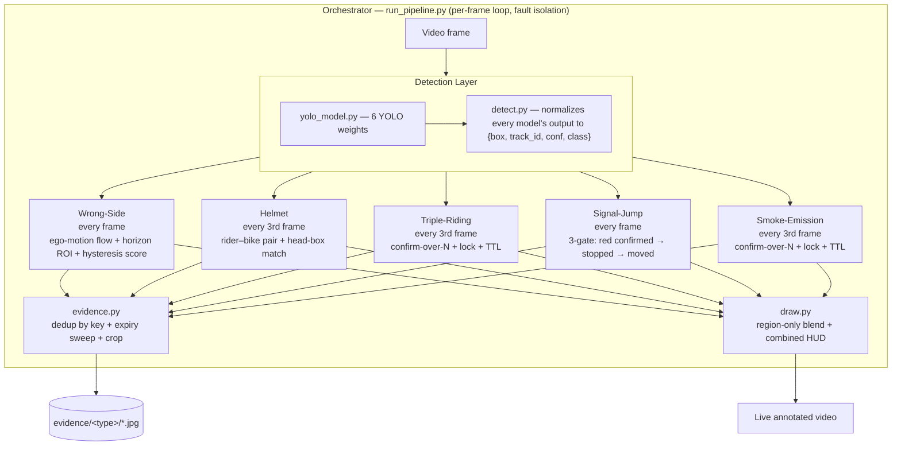

# Traffic Violation Detection System

## Overview

This project is a computer vision system for detecting traffic safety violations from dashcam-style video input. It combines object detection, tracking, lane-based risk assessment, and dedicated violation logic to identify:

- wrong-side driving
- helmet violations
- triple riding (more than two riders on a two-wheeler)
- signal jumping (red-light running, confirmed via stop-then-move state machine)
- exhaust/smoke-emission (live detection overlay only — see note below)

The system is built as a Python backend using FastAPI and Ultralytics YOLO models. All five detectors above run together in a single unified pipeline over one video feed — see [Running the Unified Pipeline](#running-the-unified-pipeline).

Smoke-emission detection is a live overlay only, not a confirmed violation: the model localizes the exhaust region per frame, but smoke-density scoring and violation confirmation/evidence-saving are not yet implemented (no confirm-over-N-frames gate, unlike the other four types).

## Tech Stack

- Python 3.x
- FastAPI
- Uvicorn
- OpenCV (`opencv-python`)
- NumPy
- Ultralytics YOLOv8
- PyTorch / TorchVision / TorchAudio
- Pillow
- PaddleOCR / PaddlePaddle
- SciPy
- Matplotlib
- Requests
- Python Multipart

## Repository Structure

```
requirements.txt
README.md
backend/
  main.py
  run_pipeline.py        ← unified multi-violation entry point
  test.py
  test_helmet.py
  test_wrong_side.py
  detection/
    detect.py
    yolo_model.py
  violations/
    helmet_violation.py
    wrong_side_violation.py
    triple_riding_violation.py
    signal_jump_violation.py
    smoke_emission_violation.py   ← pass-through only, no confirm/evidence logic
  utils/
    draw.py
    evidence.py           ← shared evidence-saving used by all violation types
    lane_utils.py
    math_utils.py
    motion_utils.py
  models/
    helmet_best.pt
    triple_riding_best.pt
    signal.pt
    smoke_best.pt
    yolov8n.pt
    yolo11n.pt
  evidence/
    wrong_side/
    helmet/
    triple_riding/
    signal_jump/
```

## System Architecture

One video frame is decoded once, then fanned out to five independent violation modules that each read the same normalized detections on their own cadence — some every frame (they need continuous optical flow), some every 3rd frame (spatial matches only, traded for throughput on CPU-only inference). All five converge on one shared evidence recorder and one shared draw/HUD service.



The "confirm → lock → reap" shape above (pending buffer of recent calls → majority reached → locked, re-fires until unseen past its TTL → reaped from memory) is shared by helmet, triple-riding, signal-jump, and smoke-emission — first written for triple-riding and reused for the other three. Wrong-side is the one exception: it accumulates a continuously decaying score per tracked vehicle instead of confirming a single detection, with its own periodic reap sweep that the TTL pattern above was later brought in line with.

### 1. Input

The system consumes video frames from a dashcam or video source.

### 2. General Object Detection

A general YOLO model (`yolov8n.pt`) is used to detect and track objects in each frame.

- Method: `detection.yolo_model.detect_general(frame)`
- Uses tracking with `bytetrack.yaml` to produce consistent `track_id` values across frames.
- Output: bounding boxes, class IDs, confidence scores, and track IDs.

### 3. Helmet Detection

A dedicated helmet model (`models/helmet_best.pt`) is used to detect helmets in head regions.

- Method: `detection.yolo_model.detect_helmet(frame)`
- Output: helmet bounding boxes and confidence scores.

### 4. Wrong-Side Violation Detection

The wrong-side violation pipeline uses general vehicle tracks, optical flow, lane ROI checks, and multi-signal scoring.

Key phases:

1. frame preprocessing
2. ego-motion estimation
3. adaptive ROI filtering
4. track maturity checks
5. proximity gating
6. bidirectional signal classification
7. hysteresis scoring and final decision

### 5. Helmet Violation Detection

The helmet violation pipeline uses general detections plus helmet detections to determine whether a rider is wearing a helmet.

Key phases:

1. person and motorcycle pairing
2. head box extraction from rider bounding boxes
3. helmet assignment by nearest rider
4. multi-frame confirmation
5. lock-and-expire logic to stabilize decisions

## Detailed Processing Workflow

### General Detection and Tracking

`backend/detection/detect.py` wraps the YOLO inference code and converts raw results into a usable detection structure:

- `box`: (x1, y1, x2, y2)
- `track_id`
- `conf`
- `class`

### Wrong-Side Detection Workflow

The main logic is implemented in `backend/violations/wrong_side_violation.py`.

#### 1. Ego Motion Estimation

- Function: `_estimate_ego(prev_gray, curr_gray)`
- Uses pyramidal Lucas-Kanade optical flow (`cv2.calcOpticalFlowPyrLK`).
- Estimates scene motion from consecutive grayscale frames.
- Computes a running exponential moving average (EMA) of ego motion magnitude.

Formulas:

- `raw = abs(dy) / scale`
- `_ego_motion = EGO_EMA_ALPHA * raw + (1 - EGO_EMA_ALPHA) * _ego_motion`
- `EGO_EMA_ALPHA = 0.25`
- `FLOW_SCALE = 0.5`

#### 2. Adaptive ROI Filtering

- Function: `inside_roi(cx, cy, frame)` in `backend/utils/lane_utils.py`
- Uses vanishing point estimation to create a horizon-relative active zone.
- Rejects detections above the dynamic horizon line.

Key formulas:

- `zone_top = vp_y + VP_MARGIN_FRAC * h`
- `VP_MARGIN_FRAC = 0.08`
- Fallback: `zone_top = int(h * VP_FALLBACK_FRAC)` with `VP_FALLBACK_FRAC = 0.45`

#### 3. Proximity Gate

The proximity gate prevents distant or irrelevant vehicles from entering violation logic.

- Function: `_proximity_score(tid, cx, cy, smooth_area, frame_w, frame_h)`
- Max score = 5
- Minimum pass score = 3

Signals:

- P1 — Size: `smooth_area >= PROX_MIN_AREA_FRAC * frame_area`
  - `PROX_MIN_AREA_FRAC = 0.12`
  - Awards 2 points.
- P2 — Vertical position: `cy >= frame_h * (1.0 - PROX_LOWER_FRAC)`
  - `PROX_LOWER_FRAC = 0.65`
  - Awards 1 point.
- P3 — Closing: area growth ratio over time.
  - `PROX_GROWTH_RATIO = 1.1`
  - `PROX_GROWTH_FRAMES = 5`
  - Awards 2 points.

Example pass cases:

- Large + closing = 4 points
- Large + low = 3 points
- Small + low + closing = 3 points

If proximity score < 3, the detection is marked distant and the score decays.

#### 4. Vehicle Classification Signals

The system evaluates both "wrong-way" and "correct" signals.

Wrong-way signals from `_check_signals(...)`:

- Signal A: size growth relative to ego motion
- Signal B: centroid inside lane danger zone
- Signal C: low lateral drift across recent frames

Correct signals:

- C1: bounding box shrinking over time
- C3: lateral drift too high (vehicle passing in its own lane)

#### 5. Threshold Logic and Scoring

The system accumulates a score per tracked vehicle and uses hysteresis to avoid flicker.

Profile parameters (`balanced` by default):

- `lane_danger_left = 0.33`
- `approach_ratio_moving = 1.18`
- `approach_ratio_stopped = 1.08`
- `score_per_frame = 10`
- `score_decay = 3`
- `score_threshold = 70`
- `score_hysteresis = 15`

Score update rules:

- If wrong-way evidence is strong, add `score_per_frame`
- If correct evidence is strong, subtract up to `score_per_frame * 2`
- Otherwise decay score by 15% each frame

Decision rules:

- Violation when score >= threshold
- Correct when score <= -threshold
- Hysteresis: use softened boundary when current state is already confirmed

#### 6. Drawing and Output

- Active violation boxes are drawn in red.
- Correct vehicles are drawn in green.
- Distant vehicles are rendered differently and excluded from alerts.
- The adaptive lane and ROI overlay is drawn on the frame.

### Helmet Violation Workflow

The helmet detection logic lives in `backend/violations/helmet_violation.py`.

#### 1. Detection Filtering

General detections are split by class:

- Person class = 0
- Motorcycle class = 3

Helmet detections are split by class as well:

- `with_helmet` boxes
- `without_helmet` boxes

#### 2. Rider Identification

A rider is defined as a person bounding box that overlaps a motorcycle box.

#### 3. Head Box Computation

Head region is estimated with `get_head_box(...)` from `backend/utils/math_utils.py`.

#### 4. Helmet Assignment

Each helmet/non-helmet box is assigned to the nearest rider only.
This avoids cross-contamination when multiple riders appear in the frame.

#### 5. Decision and Confirmation

The detector tracks each candidate rider across frames and confirms a helmet decision only after repeated evidence:

- `CONFIRM_FRAMES = 3`
- `CONFIRM_MAJORITY = 2`

Helmet dominance is evaluated by comparing best matching helmet and non-helmet scores.
Thresholds adapt to rider size:

- `HELMET_DOMINANCE_THRESHOLD = 1.5`
- Larger riders require stronger evidence.
- Growing riders require a higher threshold.

#### 6. Lock and TTL

Once a rider is classified as `violation` or `safe`, the decision is locked for `LOCK_TTL = 5` seconds.
This stabilizes output in noisy or temporary frames.

### Triple Riding Violation Workflow

The triple-riding detection logic lives in `backend/violations/triple_riding_violation.py`, backed by a custom-trained single-class model (`models/triple_riding_best.pt`, class 0 = "more than two persons on a two-wheeler") run with tracking via `detection.detect.detect_triple_riding_objects(frame)`.

#### 1. Detection

The model is run with `.track()` (ByteTrack) rather than a bare `.predict()` call, so each detection carries a `track_id` — this is what makes multi-frame confirmation possible.

#### 2. Confirmation

Mirrors the helmet detector's pattern: a track must show the violation on `CONFIRM_MAJORITY = 2` of the last `CONFIRM_FRAMES = 3` detection calls before it's confirmed. This avoids saving evidence on a single noisy frame.

#### 3. Lock and TTL

Once confirmed, a track stays "locked" and is reported on every subsequent call until it hasn't been seen for `LOCK_TTL = 5` seconds — same TTL pattern as helmet detection.

## Key Formulas

### Area and Growth

- `area = (x2 - x1) * (y2 - y1)`
- Smoothed area: `smooth_area = alpha * area + (1 - alpha) * previous_smooth_area`
  - `SIZE_EMA_ALPHA = 0.15`

### Ego motion normalization

- `ego_ratio = ego_mag / frame_w`
- `ego_inflation = 1.0 + ego_ratio * 8.0`
- `threshold = approach_ratio_moving * ego_inflation`

### Wrong-way signal condition

- `growth >= threshold`
- `threshold` depends on whether ego vehicle is stopped or moving

### Lateral drift gate

- `lateral_frac = abs(cx_last - cx_first) / frame_w`
- `signal_c` passes if `lateral_frac <= LATERAL_DRIFT_MAX`
- `LATERAL_DRIFT_MAX = 0.12`

### Proximity gate sizes

- `frame_area = frame_w * frame_h`
- `size_threshold = PROX_MIN_AREA_FRAC * frame_area`
- `PROX_MIN_AREA_FRAC = 0.12`
- `PROX_GROWTH_RATIO = 1.1`
- `PROX_GROWTH_FRAMES = 5`

## Getting Started

### Install dependencies

```powershell
python -m pip install -r requirements.txt
```

### Run the backend

```powershell
uvicorn backend.main:app --reload
```

### Access the server

Open `http://127.0.0.1:8000/`

`backend/main.py` currently exposes only a health-check endpoint — it is not yet wired to the detection pipeline. See below for how to actually run detection.

## Running the Unified Pipeline

`backend/run_pipeline.py` is the primary way to run detection today. It opens a single video feed and runs wrong-side, helmet, triple-riding, signal-jump, and smoke-emission detection together in one loop, with a combined on-screen overlay and per-type evidence saving.

```powershell
cd backend
python run_pipeline.py
```

- Point `VIDEO_PATH` at the top of the file to any local video (`test_videos/` has several `testN.mp4` clips for trying different violation types). Signal-jump needs an intersection clip with a visible traffic light to produce any detections; smoke-emission needs a visibly smoking vehicle — on other clips they'll simply report zero, which is expected.
- `test_videos/signal_green_dashcam.mp4`, `signal_red_intersection.mp4`, and `smoke_emission_visible.mp4` are free-license (Pexels) clips added specifically to validate signal-jump and smoke-emission against footage that actually contains a visible traffic light / visible exhaust smoke — none of the original `testN.mp4` clips do. Verified against the current pipeline: `signal_green_dashcam.mp4` correctly reads "green" on 75% of frames, `signal_red_intersection.mp4` correctly reads "red" on 85% of frames with zero false-positive violations (the clip shows cars properly stopped, not running the light), and `smoke_emission_visible.mp4` produces 74 confirmed smoke-emission violations. No clip yet captures an actual stop-then-run sequence for a true signal-jump violation — that still needs real red-light-running footage.
- Evidence crops are saved to `backend/evidence/{wrong_side,helmet,triple_riding,signal_jump}/`, deduplicated per tracked vehicle/rider. Smoke-emission does not save evidence (see note above — it's a live overlay only).
- Controls: `ESC` quits, `SPACE` pauses, `R` resets all detector state (smoke-emission is stateless, nothing to reset).
- General detection, wrong-side, and signal-jump run every frame (both wrong-side's optical-flow/ego-motion state and signal-jump's Lucas-Kanade stillness check need consecutive frames). Helmet, triple-riding, and smoke-emission run every 3rd frame (`FRAME_SKIP`), with a short on-screen hold so helmet boxes don't flicker between detection calls.

`backend/test_wrong_side.py` and `backend/test_helmet.py` remain available for isolating and tuning a single detector without the rest of the pipeline running.

## Notes

- The core detection logic is implemented in `backend/detection/` and `backend/violations/`.
- `backend/utils/lane_utils.py` contains the adaptive horizon ROI logic.
- `backend/utils/evidence.py` contains the shared, per-violation-type evidence recorder used by `run_pipeline.py`.
- `backend/violations/wrong_side_violation.py` contains the adaptive, score-based wrong-way violation algorithm.
- `backend/violations/helmet_violation.py` contains the helmet detection and rider pairing logic.
- `backend/violations/triple_riding_violation.py` contains the triple-riding detection and confirmation logic.
- `backend/violations/signal_jump_violation.py` contains the three-gate (red signal → confirmed stopped → moved) signal-jump state machine, including its own Lucas-Kanade optical-flow stillness check. Tuned against 960×540 frames originally; may behave slightly differently at other resolutions since `run_pipeline.py` doesn't resize.
- `backend/violations/smoke_emission_violation.py` is a pass-through — the underlying model only localizes an exhaust region per frame; there's no smoke-density scoring or confirmation logic yet.

## Recommended Improvements

- Add API endpoints to accept frames or video streams.
- Add a front-end or visualization layer for live alerts.
- Add unit/integration tests for the violation thresholds and decision logic.
- Document supported YOLO classes and label mapping.
- Implement real smoke-density scoring and a confirm-over-N-frames gate for smoke-emission, so it can graduate from live overlay to a confirmed, evidenced violation type like the other four.
- Investigate per-frame throughput — running up to 5 YOLO models per frame is CPU-heavy; consider smaller `imgsz`, ONNX/OpenVINO export, or GPU inference for closer-to-real-time performance.

## License

Add your license or usage policy here.
