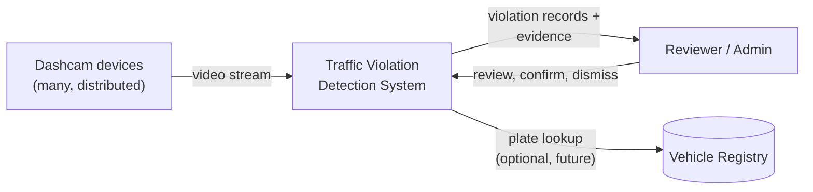
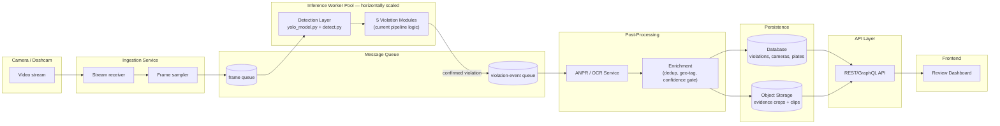
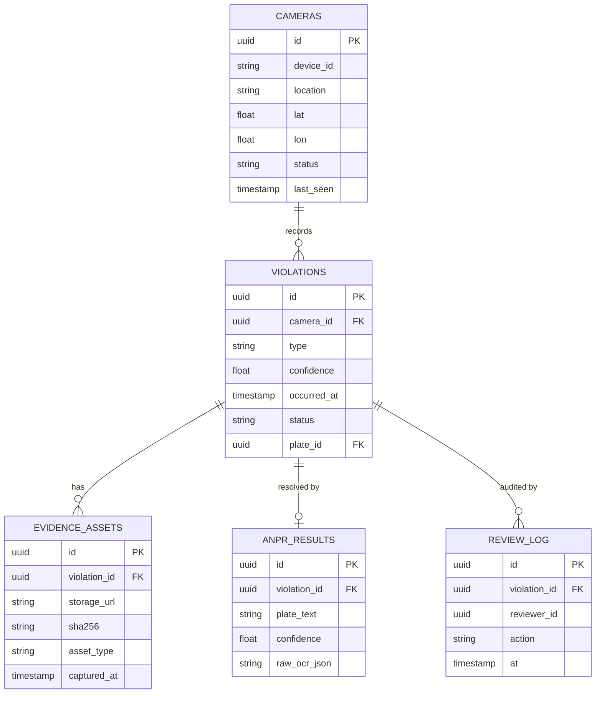
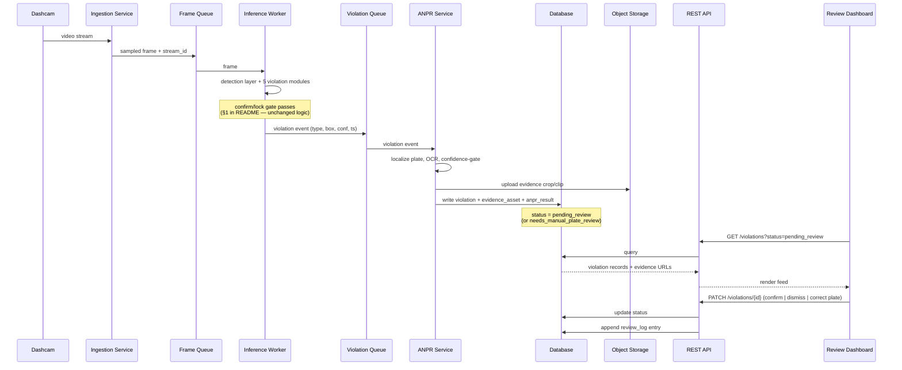
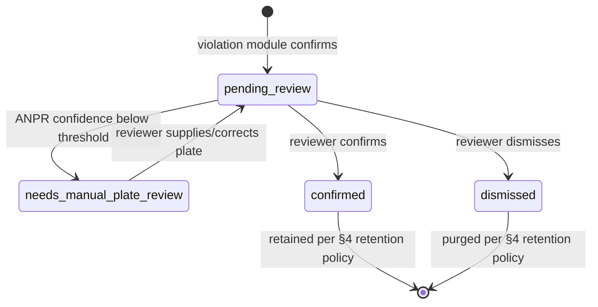
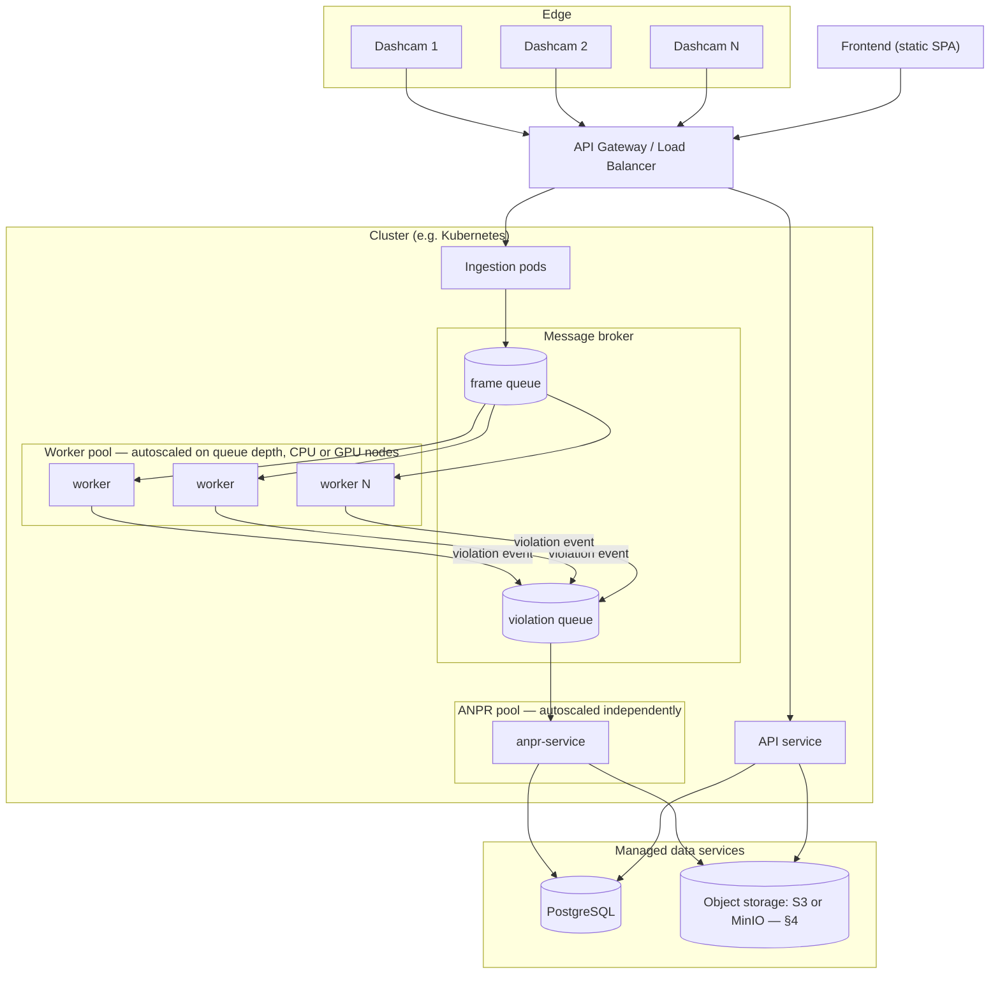

# Future System Architecture

## Why this document exists

The current system (documented in the [README](README.md) and the [HLD](https://claude.ai/code/artifact/8771f7ab-a49f-4829-bcb1-a5339fb150f6)) is one Python process: it opens one video file, runs five to six YOLO models on it sequentially, and writes evidence crops to local disk. That design was right for proving the detection logic works. It is not a system that can watch a real fleet of dashcams.

Three problems specifically force a redesign, not a tune-up:

1. **CPU-bound, single-stream, single-process.** Five to six YOLO passes per relevant frame on one CPU core does not scale by adding more video files — it scales by adding more hardware, and the current architecture has nowhere to put that hardware. There's no worker boundary to scale independently.
2. **No identity.** A confirmed violation today is a cropped JPEG with a timestamp. There's no plate number, no way to connect it to a vehicle or an owner, and no way it could be used for actual enforcement.
3. **No memory.** Evidence lives on local disk as flat files. There's no database, no API surface beyond a health check, and no way for a second person to review, confirm, or dispute a violation.

This document describes the architecture that fixes those three things: backend decomposition, a database, evidence storage with integrity guarantees, an ANPR/OCR stage, a review frontend, and a scaling strategy grounded in where the current bottleneck actually is.

---

## 1. High-Level Design (HLD)

The core move is decoupling **inference** (CPU/GPU-bound, needs to scale horizontally) from **everything downstream of a confirmed violation** (I/O-bound, scales differently). Today those are the same process. In the target architecture they're separated by a queue, so each side can be scaled, deployed, and failed-over independently.

### 1.1 System Context

Who and what the system talks to, before looking inside it:

The system has exactly one inbound data source (camera streams) and one human actor (the reviewer/admin who confirms or disputes what it flags). A vehicle-registry lookup — resolving a recognized plate to an owner record — is drawn as optional/future because it depends on external integration this document doesn't control.

### 1.2 Component View

**What stays the same:** the detection layer and five violation modules inside the worker pool are the *existing* `detection/` and `violations/` code, largely unchanged — the confirm/lock/reap pattern, the per-frame cadence, the fault isolation. That logic doesn't need to be rewritten; it needs to be run inside a worker that pulls frames from a queue instead of a local `cv2.VideoCapture` loop.

**What's new:** everything from "confirmed violation" onward — the event queue, ANPR, the database, object storage, the API, and the frontend.

---

## 2. Backend

### 2.1 Ingestion Service

Receives a video stream (RTSP from a live dashcam unit, or an uploaded file for offline processing) and pushes sampled frames onto the frame queue. This is the one place that needs to handle real network/hardware variability — dropped connections, variable frame rate, backpressure when workers fall behind. It should never block on inference; if the queue is full, it drops frames and logs the gap rather than stalling ingestion.

### 2.2 Inference Worker Pool

The current `run_pipeline.py` loop, restructured as a queue consumer instead of a `while True: cap.read()` loop. Each worker instance:

- Pulls a frame + stream ID off the frame queue
- Maintains its own per-stream violation-module state (the existing `HelmetViolationDetector`, `SignalJumpingDetector`, etc. instances — one set per stream, not shared across streams)
- On a confirmed violation, publishes a violation event (type, stream ID, frame, box, confidence, timestamp) to the violation-event queue instead of directly saving evidence

This is the layer that scales horizontally — run more worker processes/pods to handle more concurrent streams, and it's the layer that benefits from GPU hardware (see §5).

### 2.3 ANPR / OCR Service

A separate, independently-scaled service. Deliberately **not** part of the real-time detection loop — plate recognition is not gating whether a violation gets confirmed, only what gets attached to it afterward. Design:

- Consumes violation events, crops the vehicle region (padded, same pattern the current `evidence.py` already uses)
- Two-stage: a plate-localization model (small, fast — could reuse a YOLO detector fine-tuned on Indian plate regions) followed by an OCR pass (PaddleOCR or a dedicated plate-OCR model) on the localized crop, rather than running general OCR over the whole vehicle image
- Every result carries a confidence score; below a threshold, the plate field is left null and the violation is flagged `needs_manual_plate_review` rather than guessing — an enforcement system that silently attaches a wrong plate number is worse than one that admits it doesn't know
- India-specific plate format validation (state-code + district-code + series + number regex) as a sanity filter on raw OCR output before accepting it

### 2.4 Enrichment

Thin service between ANPR and persistence: deduplicates events that reference the same physical incident (a violation module can re-fire on every frame a track is still locked, per the confirm/lock/reap pattern — only the first sighting should become a new record, subsequent ones update it), attaches geo-tag if the stream has location metadata, and applies the confidence gate before writing.

### 2.5 API Layer

`main.py`'s FastAPI stub becomes the real interface. Minimum surface:

| Endpoint | Purpose |
|---|---|
| `POST /streams` | Register a camera/stream for ingestion |
| `GET /violations` | List/filter violations (by type, date range, camera, plate, status) |
| `GET /violations/{id}` | Full detail: evidence URLs, confidence, ANPR result, review history |
| `PATCH /violations/{id}` | Reviewer action: confirm, dismiss, correct plate |
| `GET /violations/{id}/evidence` | Signed URL(s) to the crop/clip in object storage |
| `GET /streams/{id}/health` | Live status — last frame seen, current FPS, worker assignment |

Auth: role-based (reviewer vs. admin vs. read-only auditor) — this data has enforcement implications, so access needs to be logged, not just gated.

---

## 3. Database

Move off flat-file-only evidence. Relational core (PostgreSQL is the reasonable default — strong consistency for records that may end up in an enforcement/legal chain, plus PostGIS if per-camera geo-queries matter later):

Notes specific to this domain:

- **`violations.status`** is an explicit state machine (`pending_review` → `confirmed` / `dismissed`), not just a detection flag — a human reviewer's decision is data, not an afterthought.
- **`evidence_assets.sha256`** — a hash captured at write time, so evidence integrity can be verified later. If this data is ever used for actual enforcement, "was this image altered after capture" needs a real answer, not an assumption.
- **`review_log`** is append-only — every reviewer action is audited, never overwritten. Evidence and its review history are exactly the kind of record that shouldn't be silently editable.
- Consider a time-series store (TimescaleDB extension on the same Postgres, or a separate ClickHouse) only if/when camera count grows enough that raw event volume — not violation volume — becomes the bottleneck. Don't add it up front.

---

## 4. Evidence Storage

Flat files under `backend/evidence/<type>/` don't survive a second server, don't have lifecycle management, and don't scale past one disk. Replace with object storage behind an S3-compatible API — that compatibility is what keeps the next decision cheap to defer:

**Cloud vs. self-hosted is an open decision, not yet made.** Both target the same S3 API, so the choice doesn't have to be locked in before the rest of this architecture gets built:

| | AWS S3 (cloud) | MinIO (self-hosted) |
|---|---|---|
| Setup effort | Lowest — no infra to run | Higher — you run and back it up |
| Recurring cost | Pay-as-you-go, scales with volume | Your own hardware/hosting cost |
| Data residency | Leaves your infrastructure (pick an India region if that matters) | Stays wherever you run it |
| Fit for this project's current stage | Fine for a demo/small deployment | Fine if this needs to stay fully on-prem |

Whichever gets picked later, the code only ever talks to an S3-compatible API — so this can genuinely stay undecided until there's a real deployment target, without blocking any other part of this design.

- **What gets stored per violation:** the padded crop (current behavior), plus — where storage budget allows — a short clip (a few seconds around the confirmed moment). A single frame is a weak evidentiary artifact; a clip showing the vehicle stopped, the light red, then the vehicle moving is a categorically stronger one, and directly addresses the exact stop-then-run sequence the signal-jump module is designed to catch but a single crop can't show.
- **Integrity:** hash at write time (see §3), object storage versioning enabled, write-once-read-many semantics for anything past the review window — once a violation is confirmed and past its dispute period, the evidence record should not be mutable.
- **Retention:** a defined policy, not indefinite storage — e.g., dismissed violations purged after N days, confirmed ones retained per whatever legal/organizational requirement applies. This is a decision to make explicitly, not default into.
- **Access:** signed, time-limited URLs handed out by the API (§2.5), never public buckets.

---

## 5. Scalability

The current bottleneck is concrete, not abstract: **5-6 sequential YOLO calls per relevant frame, on CPU, in one process, for one video.** Every scaling lever follows from that specific shape.

| Lever | What it does | When to reach for it |
|---|---|---|
| **Horizontal worker scaling** | Run N inference worker instances behind the frame queue, each handling a subset of streams | First lever — needed as soon as there's more than one camera |
| **GPU inference** | Move the worker pool from CPU to GPU; batch frames across streams to amortize model-load overhead | As soon as per-stream latency on CPU workers can't keep up with incoming frame rate |
| **Model consolidation** | Longer-term: replace 5-6 separate model passes with fewer multi-task models | Once accuracy work has stabilized — this is an optimization on top of correct behavior, not a substitute for it |
| **Edge pre-filtering** | If dashcam hardware supports it (e.g. Jetson-class), run a lightweight first-pass filter on-device and only upload frames with plausible activity, not every frame | Once bandwidth from many devices to central ingestion becomes the constraint, not before |
| **Autoscaling on queue depth** | Standard queue-depth-driven autoscaling (Kubernetes HPA or equivalent) on the worker pool | Once running in a cluster at all — makes the horizontal scaling lever self-managing |

**Latency budget, stated explicitly:** this does not need to be a hard real-time system. The signal-jump module's own gates (confirmed-red → confirmed-stopped → moved) already require several seconds of continuous observation before a violation can even exist. A few seconds of queue lag between camera and confirmed-violation record is acceptable and is exactly what buys the freedom to decouple ingestion from inference in the first place. Don't spend engineering effort chasing sub-second latency this domain doesn't need.

---

## 6. Frontend

A review dashboard, not a public-facing product (that's a possible future extension, not a requirement here):

- **Live status view** — which cameras are online, current FPS, queue depth per stream
- **Violation feed** — filterable table (type, date, camera, plate, status), the primary reviewer workflow
- **Evidence review** — view the crop/clip, confirm or dismiss, correct a wrong ANPR read; every action here writes to `review_log`
- **Reporting** — counts by type/location/time, the kind of aggregate view that justifies why this system exists operationally

Tech choice is not load-bearing to this document — a standard React/TypeScript SPA against the REST API in §2.5 is the unremarkable, correct default here.

---

## 7. Build Order

Not everything above should be built at once. A phased order that keeps the system runnable at every step:

1. **Wire the existing FastAPI stub for real** — expose the current single-process pipeline over HTTP (submit a video, get results back) before decomposing anything. Proves the API shape against real behavior first.
2. **Introduce the queue and split ingestion from inference** — the current pipeline logic moves into a worker that consumes frames from a queue instead of reading a file directly. This is the architectural change everything else depends on.
3. **Add the database and object storage** — migrate evidence off flat files; violations become queryable records, not just JPEGs on disk.
4. **Build the ANPR/OCR service** — wire it as a consumer of the violation-event queue, confidence-gated as described in §2.3.
5. **Build the review frontend** — now that there's an API and real records to review.
6. **Scale hardening** — GPU workers, autoscaling, multi-camera load testing.
7. **Edge deployment** *(optional, evaluate based on target hardware)* — only if the deployment target is dashcam-side compute, not centralized ingestion.

Each phase produces something that works end-to-end — this is a sequence of working systems, not a big-bang rewrite.

---

## 8. Low-Level Design (LLD)

The HLD (§1) shows which components exist and how data moves between them at rest. This section goes one level down: the actual message sequence for one violation, the state a violation record moves through, where each component runs, and — concretely — which files in this repo become which future service.

### 8.1 End-to-End Sequence

One frame, followed all the way from camera to reviewer, showing every hop from §1's component view as an actual message:

The two `Note` callouts mark the seams that matter most: the confirm/lock gate is where the *existing* detection code's decision becomes an event (nothing upstream of that note changes), and the status branch is where a low-confidence ANPR read diverts to manual review instead of silently entering the confirmed record.

### 8.2 Violation Lifecycle

`violations.status` (§3) isn't a flag, it's a state machine — this is what it actually looks like:

A record only ever leaves `pending_review` through a human action or an explicit retention rule — nothing here is auto-confirmed.

### 8.3 Deployment Topology

Where each component in §1.2 actually runs, and which parts scale independently:

The two pools that matter for cost and latency — **worker pool** and **ANPR pool** — scale on separate autoscaling triggers, because they have separate load shapes: worker load tracks incoming camera count, ANPR load tracks *confirmed violations*, which is a much smaller, spikier number.

### 8.4 Code &rarr; Service Mapping

The concrete answer to "how do we actually build this": what exists today in this repo, and which future service it becomes.

| Exists today | Becomes | Change required |
|---|---|---|
| `backend/detection/yolo_model.py`, `detection/detect.py` | Detection layer inside the **Inference Worker** | Runs unchanged — just called from a queue consumer loop instead of `run_pipeline.py`'s `cv2.VideoCapture` loop |
| `backend/violations/*.py` | Violation modules inside the **Inference Worker** | Unchanged logic; instantiated per-stream instead of once per process |
| `backend/utils/evidence.py` | Split: dedup/expiry logic → **Enrichment**; crop/save logic → **ANPR service**'s storage write | The dedup-by-key pattern is exactly what Enrichment needs; the save-to-disk call becomes a save-to-object-storage call |
| `backend/utils/draw.py`, HUD code in `run_pipeline.py` | **Review Dashboard**'s evidence viewer (rendered client-side instead of burned into the video frame) | Rewritten, not ported — a web UI draws its own overlays from stored box coordinates rather than compositing onto a video frame |
| `backend/main.py` (FastAPI stub) | **REST API** service | Real endpoints added per §2.5; framework choice unchanged |
| *(doesn't exist yet)* | **Ingestion Service** | New |
| *(doesn't exist yet)* | **ANPR / OCR Service** | New |
| *(doesn't exist yet)* | **Frontend** | New |
| Flat files in `backend/evidence/` | **Object storage** (§4) | New; migration script needed for any evidence worth keeping from the current system |
| *(doesn't exist yet)* | **PostgreSQL** (§3) | New |

The left column is exactly what §7's Build Order phase 1&ndash;2 carries forward unchanged; everything in the right column with *(doesn't exist yet)* on the left is what phases 2&ndash;5 actually build.

---

## 9. Technology Stack

Every choice below is judged against the same three questions: does it hold up as load grows (**scalable**), does it fail safely and stay debuggable when something breaks (**reliable**), and can this actually get built without the stack itself becoming the hard part (**buildable**)? Where those three pull in different directions, buildable wins for anything not on the critical scaling path — this project doesn't need the theoretically-best tool everywhere, it needs to actually get built and then grow.

### 9.1 Backend &amp; Workers

| Layer | Choice | Scalable | Reliable | Buildable |
|---|---|---|---|---|
| Language | **Python 3.11+** | Every layer of this stack (workers, API, ANPR) stays one language — no serialization boundary between the ML code and the service code | Mature async support (asyncio) for I/O-bound paths | Already the language of the entire existing `detection/`/`violations/` codebase — zero rewrite cost to keep it |
| API framework | **FastAPI** (already in use) | Native async request handling; horizontally replicable behind a load balancer, no shared state | Pydantic validation catches malformed requests before they reach business logic | Auto-generates the OpenAPI spec this doc flagged as missing — the API-contract gap closes for free as endpoints are written |
| API server | **Uvicorn behind Gunicorn** (multi-worker) | Add worker processes per CPU core, then add API replicas | Gunicorn restarts crashed workers automatically | Standard FastAPI deployment pattern, one config file |
| Frame queue | **Redis Streams** | Consumer groups give each inference worker its own offset — add workers to add throughput | At-least-once delivery via `XACK`; unacked messages are visible for retry via `XCLAIM`, so a crashed worker doesn't silently drop frames | One Redis instance to run locally (`docker run redis`); the same instance can back auth sessions and rate limiting too, so it's not a single-purpose dependency |
| Violation-event queue | **Celery, Redis as broker** | Add ANPR worker replicas independently of frame-processing workers | Built-in retry policy, dead-letter handling, and a monitoring UI (Flower) out of the box | Mature, extremely well-documented Python task-queue library — this is one-shot "process this confirmed violation" work, which fits Celery's task model better than the continuous frame stream does |
| Containerization | **Docker**, one image per service | Images are the unit that gets replicated | Identical artifact runs in dev and production — eliminates "works on my machine" | Every layer above already has an official Docker image or a trivial Dockerfile |
| Orchestration | **Docker Compose** to start; **Kubernetes** (k3s if self-hosting, EKS/GKE if cloud) once autoscaling on queue depth is actually needed | K8s HPA scales the worker/ANPR pools on queue depth (§8.3) | K8s restarts failed pods and reschedules around node failure | Compose is genuinely a one-command local environment during phases 1&ndash;4 of the build order (§7) — don't adopt Kubernetes before there's a queue-depth signal worth autoscaling on |

### 9.2 Data

| Layer | Choice | Scalable | Reliable | Buildable |
|---|---|---|---|---|
| Database | **PostgreSQL 15+** | Read replicas for the reporting queries in §6; PostGIS available the moment per-camera geo-queries matter | ACID transactions — a violation record and its evidence_asset row commit together or not at all, which matters for records with legal weight | Managed options everywhere (RDS, Cloud SQL, Supabase, or a local container) — no bespoke ops needed to start |
| ORM / migrations | **SQLAlchemy 2.0 (async) + Alembic** | Connection pooling built in | Alembic migrations are version-controlled and reversible &mdash; schema changes are reviewable, not ad hoc `ALTER TABLE`s | Standard FastAPI + Postgres pairing, extensive documentation |
| Object storage client | **boto3** against an S3-compatible endpoint | Same client code scales from one MinIO container to a multi-region S3 bucket | S3 API guarantees (versioning, strong read-after-write) underpin the integrity story in §4 | This is *how* §4's cloud-vs-self-hosted decision stays deferrable — `boto3` talks to AWS S3 and to MinIO identically, so the code doesn't encode that decision |

### 9.3 ANPR / OCR

| Layer | Choice | Scalable | Reliable | Buildable |
|---|---|---|---|---|
| Plate localization | **YOLOv8/v11, fine-tuned on Indian plates** | Same inference pattern as the existing 5 violation models &mdash; runs in the same worker-pool shape | Confidence-gated per §2.3 &mdash; a low-confidence box triggers manual review instead of a guess | Reuses Ultralytics tooling already integrated in this codebase &mdash; no new ML framework to learn |
| Text recognition | **PaddleOCR** | Batches well on GPU when the ANPR pool moves off CPU | Stronger on angled/distorted dashcam-crop text than Tesseract, which matters directly for false-plate-read risk | Open-source, actively maintained, pip-installable |
| Format validation | **Regex sanity filter** on OCR output against Indian plate formats (state code + district code + series + number) | N/A &mdash; negligible cost | Rejects OCR output that isn't even shaped like a real plate before it reaches the confidence gate | A few lines of code, no dependency |

### 9.4 Frontend

| Layer | Choice | Scalable | Reliable | Buildable |
|---|---|---|---|---|
| Framework | **React + TypeScript + Vite** | Static build output, served from a CDN &mdash; scales to any traffic level for free | TypeScript catches API-shape mismatches at compile time, not in a reviewer's browser | Largest ecosystem of any frontend stack; Vite's dev server is fast enough that the feedback loop doesn't fight the build process |
| Data fetching | **TanStack Query** | Automatic caching/dedup of API calls | Built-in retry and stale-data handling &mdash; the violation feed doesn't silently go stale during a network blip | Removes almost all hand-written loading/error-state boilerplate |
| Components | **Mantine** | N/A | Accessible components out of the box | A full data-table component ready for the violation feed (§6) without building one from scratch |

### 9.5 Auth, Observability &amp; CI

| Concern | Choice | Scalable | Reliable | Buildable |
|---|---|---|---|---|
| Auth | **FastAPI-Users** (JWT, role-based) on top of the same Postgres/SQLAlchemy stack | Stateless JWTs &mdash; no shared session store to scale | Battle-tested auth flow instead of a hand-rolled one, which is where most auth security bugs actually come from | Plugs directly into the FastAPI + SQLAlchemy choices already made &mdash; no separate auth service to stand up |
| Logging | **structlog**, JSON output | Structured logs ship cleanly to any aggregator later | Every log line is queryable by field (stream_id, violation_id) &mdash; essential once a violation's trail crosses 5+ services | Drop-in replacement for the standard `logging` module |
| Metrics | **Prometheus + Grafana** | Pull-based scraping scales to any number of service instances without reconfiguring them | Dashboards make "is the worker pool keeping up with the frame queue" an answerable question, not a guess | Free, self-hostable, `prometheus-fastapi-instrumentator` wires FastAPI up in a few lines |
| Error tracking | **Sentry** | Handles volume via sampling as traffic grows | Captures the full stack trace and request context for the exact failures §8.1's sequence diagram shows can happen | Free tier is enough for a project at this stage; SDK is a 5-minute integration for both the Python backend and the React frontend |
| CI/CD | **GitHub Actions** | Parallel jobs scale with the number of services being tested/built | Every merge to `main` runs the test suite before it can break anything | Already hosting this repo &mdash; zero new signup, generous free tier, and the existing commit history (this session's own fixes) is exactly what a test suite here would guard |

### 9.6 What running this locally looks like

The point of the choices above is that **phases 1&ndash;4 of the build order (§7) run entirely on one laptop.** A `docker-compose.yml` bringing up Redis, Postgres, MinIO, the API, and one worker replica is the whole local environment &mdash; no cloud account, no Kubernetes cluster, needed until autoscaling (§9.1's Kubernetes row) actually becomes the bottleneck being solved.
